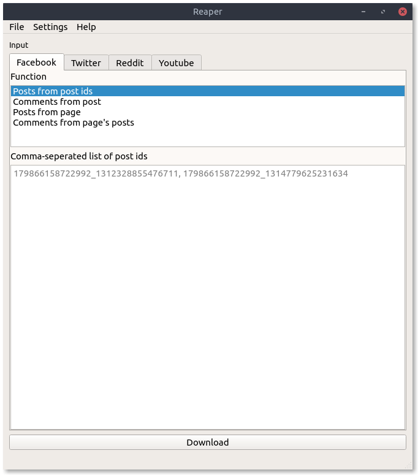
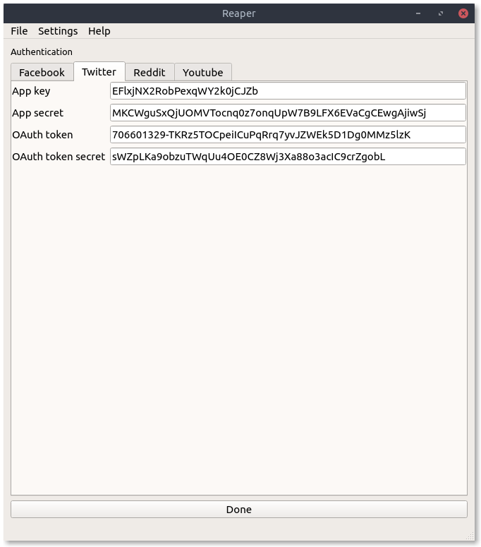
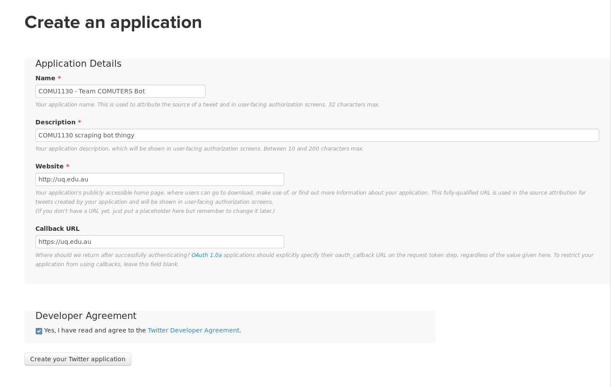
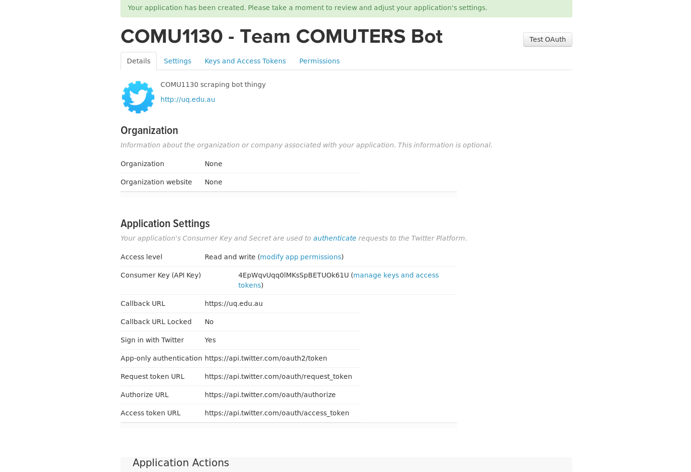
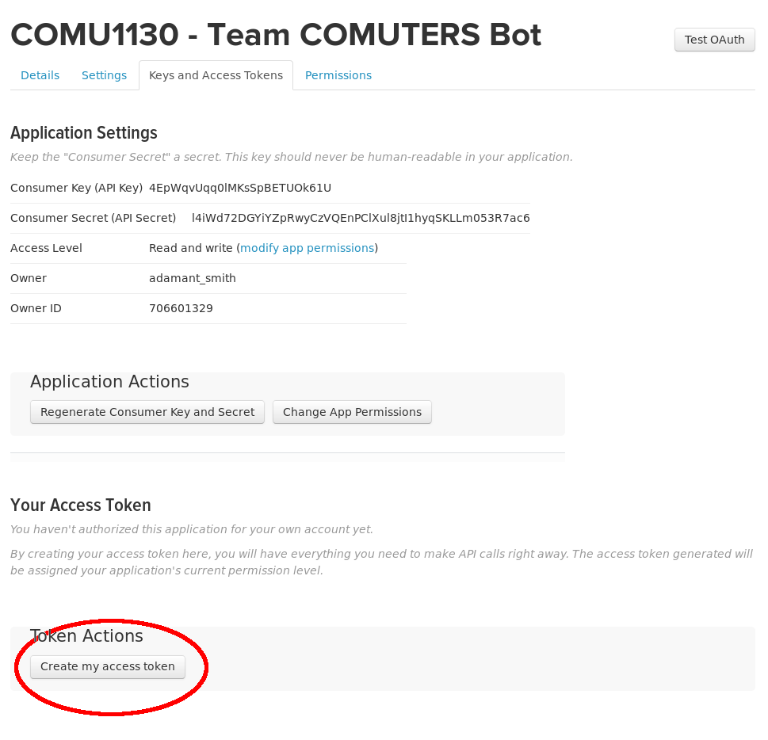
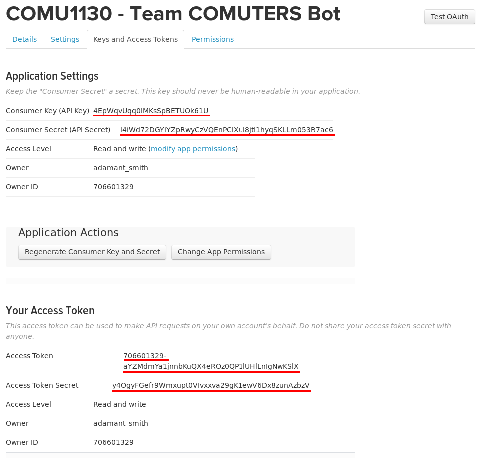
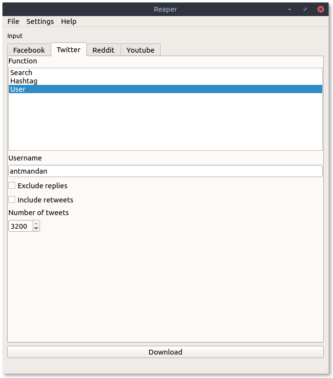
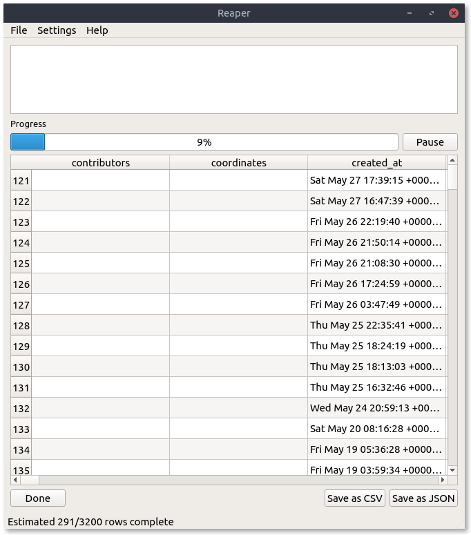
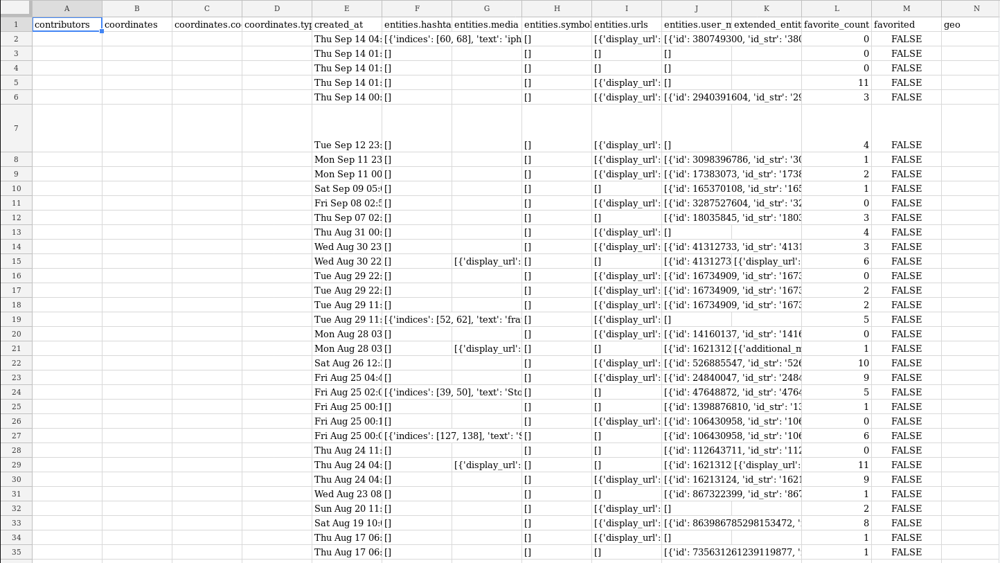

# Reaper tutorial
This is a tutorial for the web scraping software Reaper.

Reaper is software that's used extensively in COMU3120. If you've already done COMU3120, you can [skip steps 1-4](# Step 5 - Download the tweets from a Twitter user) and set up Reaper yourself.

Everyone in your group should attempt to complete this tutorial, but you are not required to finish it if:
- You don't have a computer with you
- Reaper won't start on your computer
- Twitter won't let you use their API

As you follow this tutorial, if you try something and it doesn't work, read the notes under the [Help](#Help) heading before asking a tutor.

If you need help with this task outside of class, there will be a pinned post in the COMU1130 facebook group that you can comment on.

Reaper works on the following operating systems:
- Windows
    - 7
    - 8
    - 10
- Mac OS
    - Sierra

If you don't have a computer with one of those operating systems, Reaper will not start, and you won't be able to do the tutorial. Don't try to update your computer during class, you won't have time.

# Help
## Reaper won't start
You need to make sure that you're using Windows 7 or higher, or macOS Sierra. If not, you won't be able to complete the tutorial.

### I'm using macOS Sierra and it's still not starting
Open up the app store and check the updates tab. If there is an option to install macOS Sierra, then you are not using macOS Sierra. Don't install the update in class because it will take too long

## I downloaded Reaper to my Mac, but when I open it it says that it can't be opened because it's from an unidentified developer
You can't open Reaper initially by double-clicking on it. You need to right-click it, and then in the right-click menu, select `Open`. Then click 'Ok' when the next window pops up

## Twitter won't let me give it my phone number
### The number is used by another account
If you've used that number to authenticate another Twitter account, complete this process on that twitter account instead

### Some other error
Sometimes when a lot of people in one location try to do this at once, Twitter thinks that something fishy is going on and won't allow anyone else to do it.

If this is the case, you can ask someone in your team who has signed up, to create another twitter app by following the process at [Step 4](#Step 4 - Get API keys), and sending you the keys.

Make sure that person creates another app, Reaper won't work if two people are downloading something with the same set of keys

## When I click 'Download' in Reaper, nothing happens, or an error pops up
1. You might just need to wait a bit, give it 15 seconds
2. Make sure you're connected to the internet
3. Make sure you gave the correct Twitter username (no spaces or incorrect characters). Try opening up your browser and typing in `twitter.com/` and then copy what you put in the username box
4. Make sure you gave Reaper the correct API keys (no spaces, and you copied the entire string)

## Reaper says 'Too many table fields to display' when I download data
That's fine. All it means is that there are a lot of columns in your data, and rather than displaying them all as it's downloading and wasting CPU resources, it's choosing not to display them. Once the download is complete, just click the button to save the data.

## The download completed, but it's just an empty screen
You might be looking at the tweets of a protected user. Try looking at the tweets of another.

## I saved the CSV file that Reaper gave me, but I can't figure out where I put it
You probably saved it in a hidden foler at `~/.config/reaper`. You can just save the file again somewhere else by clicking the button again.

# Guide
## Step 1 - Download Reaper
In Learning Resources, there is a folder called Reaper. Download the macOS version if you're using a Mac, and the Windows version in you're using Windows.

## Step 2 - Run Reaper
### macOS

1. Download the zip file appropriate to your platform
2. Extract the zip file
3. Open finder
4. Navigate to the folder (Downloads) containing the extracted file
5. Right click Reaper
6. Click Open
7. Click 'Ok'

You should now see the Reaper welcome menu. Continue past this sceeen

### Windows

1. Download the zip file appropriate to your platform
2. Extract the zip file
3. Navigate to the extracted folder reaper
4. double-click reaper.exe

You should now see the Reaper welcome menu. Continue past this sceeen

## Step 3 - Set up Reaper
Reaper should now look like this:

This is the main window of Reaper. You can change the platform you're downloading from by changing the tabs in this window
If in the top menu (the very top bar on macOS) you click `Settings` -> `Authentication` you are taken to another window

This is where you need to give your Twitter API keys

## Step 4 - Get API keys
You need to sign in to twitter. Try doing so with the twitter account you just tweeted from in the debates

1. Make sure that twitter has your mobile phone details by going [here](https://twitter.com/settings/devices) and adding your phone (if not already there). You cannot get an API key without doing this step
2. Visit [https://apps.twitter.com/](https://apps.twitter.com/) and sign up for the twitter developer platform
3. Create a new app by going [here](https://apps.twitter.com/app/new), or clicking the 'Create New App' button
4. Give your application any name, make sure it's unique like `COMU1130 - Team name bot`
5. Give it some some description like `COMU1130 scraping app`
6. Give it the website `https://uq.edu.au`
7. Put the same thing into the callback url
8. Tick the box to agree to the developer agreement
9. Click the create button

You'll then be taken to this page:

Click the 'Keys and Access Tokens' tab

On that page, click 'Create my access token'

Now you need to copy the text from the following 4 highlighted locations on that page, into the authentication window in Reaper.

It's important that you copy all the text, and that you don't copy any extra space at the end. Don't assume that you've done this correctly. Once you've copied it in make sure that there isn't any whitespace

Consumer Key -> App Key
Consumer Secret -> App Secret
Access Token -> OAuth Token
Access Token Secret -> OAuth token secret

Once you've copied that in, click 'Done' to take you back to the main menu

## Step 5 - Download the tweets from a Twitter user

As a group, think of a Twitter user that you'd like to analyse.

Select the 'User' function, and give the username. The maximum number of tweets you can download is 3200.

Click the 'Download' button

The download will then begin

Once it's complete, click 'Save as CSV' in the bottom right corner and save the file.

## Step 6 - Analyse the tweet
You've just created a CSV file. A CSV file is a text file that describes a table of data. View the file by opening it in Excel, Numbers for Mac, or Google Sheets.

Each tweet is represented by a row in the table. And, each tweet has an attribute like 'created_at' or 'text' which is shown in it's respective column.

Have a look at some of the attributes

Here are some important ones:
- created_at
- favorite_count
- in_reply_to_screen_name
- place.full_name
- retweet_count
- text

Your task is to:
> Write a blog post (one per group) about the difference between the most popular, and the least popular tweets.

So you need to find a way to sort tweets by some attribute that best represents popularity.

If you don't know how to sort data in your spreadsheet program, follow these guides:

- [Excel](https://www.gcflearnfree.org/excel2016/sorting-data/1/)
- [Google sheets](https://support.google.com/docs/answer/3540681?co=GENIE.Platform%3DDesktop&hl=en)
- [Numbers for Mac](https://support.apple.com/kb/PH23768?locale=en_US&viewlocale=en_US)

In your analysis, try to compare the most popular and least popular tweets by their text, type of tweet, location, time of day, device used, whether it was a retweet, etc. If you can identify a factor that changes the popularity of tweets, inclue it in your analysis.
